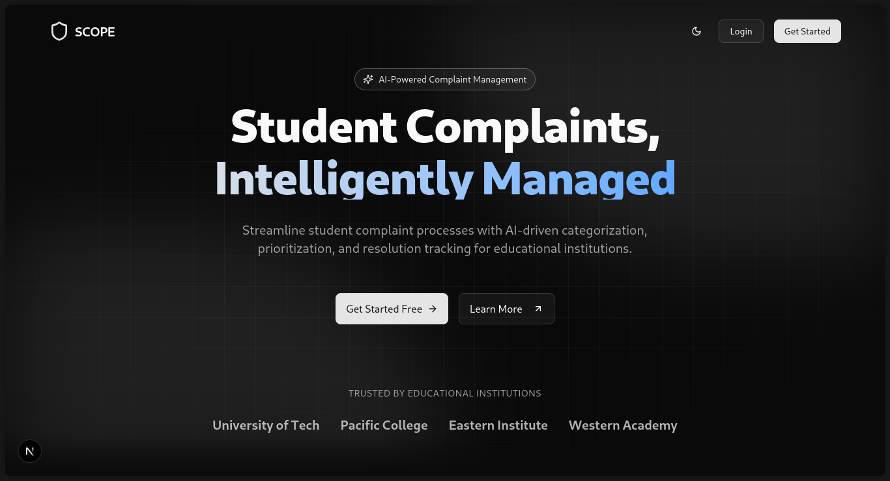
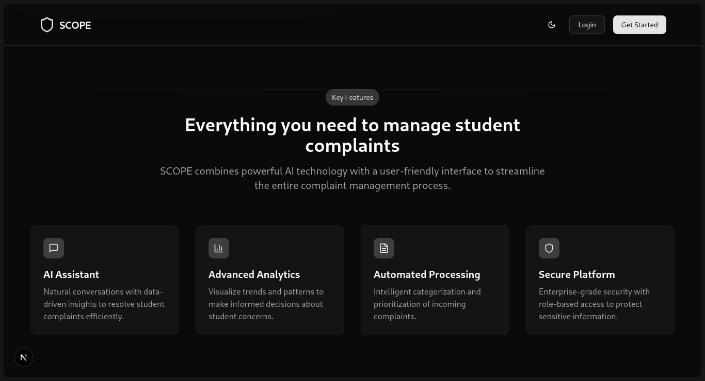
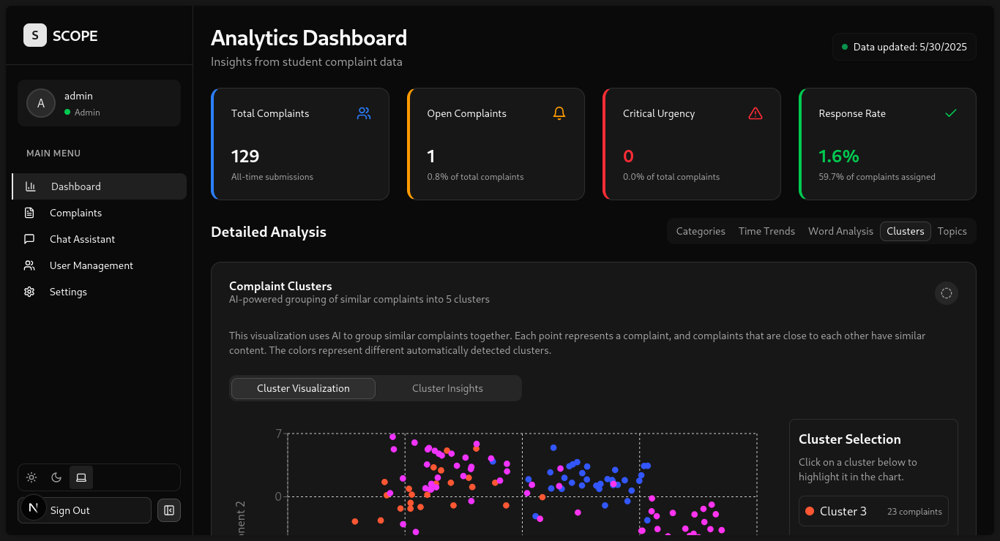
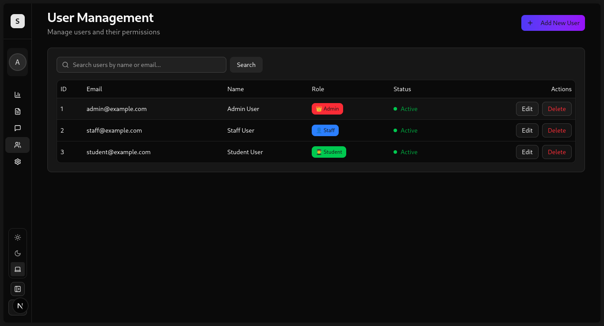
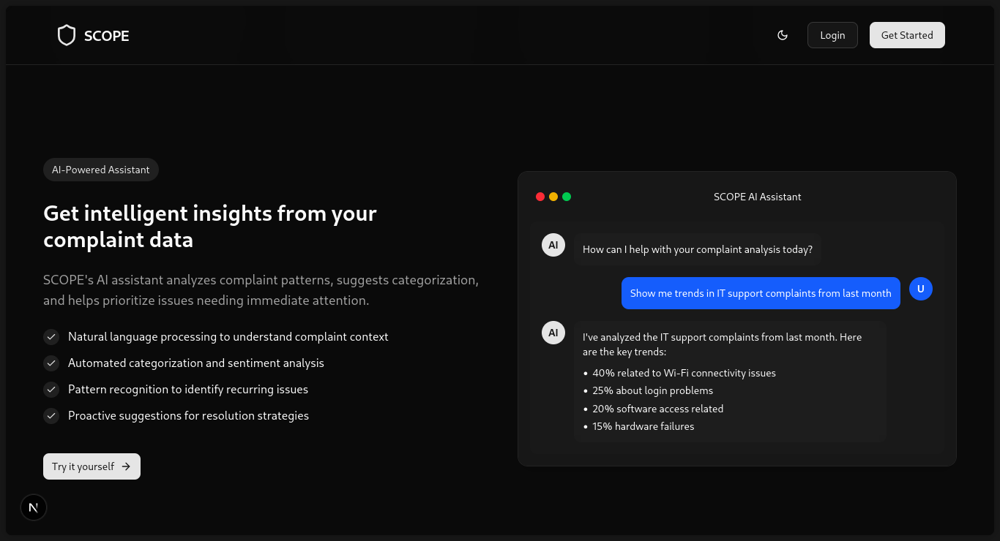

<div align="center">

# 🎓 SCOPE

### Student Complaint Optimisation and Prioritisation Engine

[](https://fastapi.tiangolo.com/)
[](https://nextjs.org/)
[](https://www.python.org/)
[](https://www.typescriptlang.org/)
[](https://huggingface.co/)
[](https://langchain.com/)
[](https://opensource.org/licenses/MIT)

</div>


<p align="center">
  <b>SCOPE</b> is an intelligent system designed to streamline the handling of student complaints within educational institutions. It automatically classifies incoming complaints by <b>category</b> and <b>urgency</b>, enabling staff to prioritize and address critical issues efficiently.
</p>

<hr>

## ✨ Key Features

*   **🧠 Automated Complaint Classification & Prioritization:** Utilizes a fine-tuned DistilBERT multi-task model to accurately categorize complaints and assess their urgency.
*   **📊 Interactive Dashboards:** Role-specific dashboards (Admin, Staff, Student) providing insights into complaint trends, response times, and common topics using charts and visualizations.
*   **🤖 AI Chatbot Assistant:** A RAG-based chatbot powered by Google Gemini and LangChain, equipped with tools to query complaint data, provide summaries, and assist users.
*   **🔐 Secure Authentication:** JWT-based authentication ensures secure access for different user roles.
*   **⚙️ Full-Stack Architecture:** Robust FastAPI backend and a modern Next.js frontend with TypeScript.
*   **📈 Data Analytics:** Endpoints for analyzing trends, identifying high-priority issues, and exploring common complaint topics.

## Screenshots 

<div align="center">

<details>
<summary>📸 <strong>View Screenshots</strong></summary>

<br>

**🏠 Landing Page**

*Welcome to SCOPE - Your intelligent complaint management system*

<br>

**🎯 Features Overview**

*Comprehensive feature set for efficient complaint handling*

<br>

**📊 Analytics Dashboard**

*Real-time insights and data visualization for informed decision-making*

<br>

**🧠 AI-Powered Classification & Prioritization**

*Automated complaint categorization and urgency assessment*

<br>

**👥 User Management System**

*Role-based access control and user administration*

<br>

**🤖 AI Chatbot Assistant**

*Advanced RAG-based features for complaint data analysis*

*Interactive AI assistant powered by Google Gemini and LangChain*
<br>


</details>

</div>


## 🛠️ Tech Stack

*   **Backend:**
    *   Python 3.10+
    *   FastAPI
    *   SQLAlchemy (with SQLite)
    *   Pydantic
    *   Transformers (Hugging Face)
    *   PyTorch
    *   LangChain, LangChain Google Genai
    *   Uvicorn
*   **Frontend:**
    *   Node.js 18+
    *   Next.js (App Router)
    *   TypeScript
    *   React
    *   Tailwind CSS
    *   Shadcn/ui (Radix UI & Tailwind)
    *   Recharts
    *   Axios
*   **Database:**
    *   SQLite (default for local development)
*   **ML Model:**
    *   Fine-tuned DistilBERT/RoBERTa (Multi-task classification)

## 🚀 Getting Started (Local Setup)

Follow these steps to set up and run the SCOPE project locally.

**Prerequisites:**

*   Git
*   Python 3.10 or later
*   Node.js 18 or later (includes npm/yarn/pnpm)
*   Access to a terminal or command prompt

**1. Clone the Repository:**

**2. Backend Setup (FastAPI):**

> I have used [uv](https://docs.astral.sh/uv/) in development, but following the instructions below will work too.

```bash
# Navigate to the backend directory
cd scope-backend

# Create a Python virtual environment
python -m venv venv

# Activate the virtual environment
# On macOS/Linux:
source venv/bin/activate
# On Windows:
.\venv\Scripts\activate

# Install backend dependencies
pip install -r requirements.txt

# Set up environment variables
cp .env.example .env

# !! IMPORTANT !!
# Edit the .env file:
# - Replace SECRET_KEY with a strong, unique secret.
# - Add your GOOGLE_API_KEY if you want to use the chatbot features.
# - Adjust DATABASE_URL or other settings if needed.

# Seed the database with initial data (optional but recommended)
# This creates default users and sample complaints
python ../scripts/seed_data.py ../data/complaints-small.csv # Use complaints.csv for more data

# Start the backend server
uvicorn main:app --reload --host 0.0.0.0 --port 8000
```

The backend API will be running at `http://localhost:8000`. You can access the interactive API documentation (Swagger UI) at `http://localhost:8000/docs`.

**3. Frontend Setup (Next.js):**

```bash
# Open a NEW terminal window/tab
# Navigate to the frontend directory from the project root
cd scope-frontend

# Install frontend dependencies
npm install
# or yarn install or pnpm install

# Set up environment variables
cp .env.local.example .env.local

# !! IMPORTANT !!
# Edit the .env.local file if your backend is running on a different URL
# NEXT_PUBLIC_API_URL=http://localhost:8000 # Default

# Start the frontend development server
npm run dev
# or yarn dev or pnpm dev
```

The frontend application will be running at `http://localhost:3000`.

**4. Access the Application:**

Open your web browser and navigate to `http://localhost:3000`. You can log in using the default credentials.

## 🔑 Default Users

*   **Admin:** `admin@example.com` / `adminpassword`
*   **Staff:** `staff@example.com` / `staffpassword`
*   **Student:** `student@example.com` / `studentpassword`

*(Remember to change these default passwords in a production environment!)*

## ⚙️ Environment Variables

Configuration is managed via environment variables. Example files are provided:

*   `scope-backend/.env.example`: Contains settings for the FastAPI backend (database URL, JWT secret, Google API key, etc.). Copy this to `.env` and fill in your values.
*   `scope-frontend/.env.local.example`: Contains settings for the Next.js frontend (primarily the backend API URL). Copy this to `.env.local` and adjust if necessary.

**Crucially, the actual `.env` and `.env.local` files should NOT be committed to version control.** They are included in the `.gitignore` file.

## 📚 API Documentation

The backend API includes automatically generated documentation using Swagger UI. Once the backend server is running, access it at:

[http://localhost:8000/docs](http://localhost:8000/docs)

## 🔮 Future Enhancements

*   Integration with a dedicated front-end dashboard (In Progress)
*   Email notifications for high-priority complaints or status updates.
*   More sophisticated analytics and reporting features.
*   Enhanced chatbot capabilities with more tools and context awareness.
*   Deployment scripts and configurations (Docker, etc.).
*   User profile management.

## 🤝 Contributing

Contributions are welcome! Please follow standard Gitflow practices. (Add more detailed contribution guidelines if needed).

1.  Fork the repository.
2.  Create a new branch (`git checkout -b feature/your-feature-name`).
3.  Make your changes.
4.  Commit your changes (`git commit -m 'Add some feature'`).
5.  Push to the branch (`git push origin feature/your-feature-name`).
6.  Open a Pull Request.

## 📜 License

This project is licensed under the MIT License - see the [LICENSE](LICENSE) file for details.
